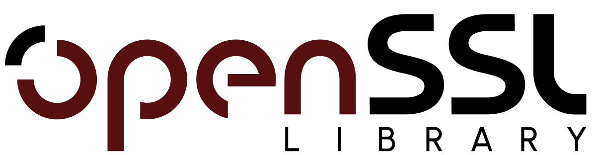
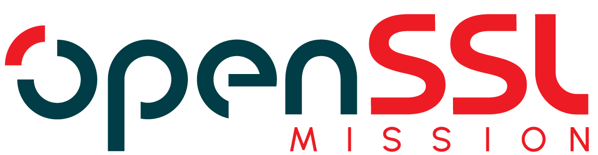
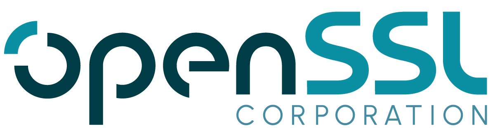

# Trademark Policy

Last modified 2024-10-08

## Purpose

OpenSSL is committed to promoting the use of its open-source software. While
open-source software is generally free to download and modify, the use of
open-source software does not include the right to use OpenSSL Trademarks.

The Trademark Policy (The Policy) aims to protect and ensure consistent usage
of the OpenSSL Trademarks and to clarify when and how OpenSSL Trademarks may be
used.

The Policy aims to:

1. Encourage appropriate, authorized use of the OpenSSL Trademarks;
2. Prevent misuse of the OpenSSL Trademarks that can confuse or mislead users
   with respect to the source of the goods and services.

Please note that it is not the goal of The Policy to limit commercial
activity around OpenSSL. We encourage businesses to work with OpenSSL’s software
while being compliant with The Policy.

## Scope

OpenSSL Trademarks means trademarks, service marks, names, logos, or other
designations owned by OpenSSL, including, but not limited to: (1) OpenSSL,
(2) OpenSSL Logo, (3) OpenSSL FIPS Provider, and (4) all other names and logos
associated with OpenSSL’s products, services, programs, projects and
initiatives.

The Policy applies to all persons who use or intend to use the OpenSSL
Trademarks.

## Principles

* OpenSSL Trademarks can only be used in line with The Policy.
* OpenSSL Trademarks can only be used to identify OpenSSL, its products and
services in a way that is accurate, not misleading or disparaging of
OpenSSL, its products, services, communities, or users.
* OpenSSL Trademarks cannot be modified, combined with other marks or used as
part of a larger mark.
* You may not use marks that are confusingly similar to OpenSSL Trademarks, or
that may be misleading or cause confusion in the marketplace, or imply any
affiliation with or endorsement by OpenSSL.
* Except as provided in The Policy, use of OpenSSL Trademarks is prohibited
without express written permission from OpenSSL. Use without written
permission may violate OpenSSL’s trademark rights.

## When OpenSSL Trademarks can NEVER be used without permission

Prior written permission must be provided in order to use OpenSSL Trademarks in
all circumstances except those listed under the “When OpenSSL Trademarks can be
used without permission” section.

In general:

1. You cannot use OpenSSL Trademarks in any way that suggests an affiliation
   with, sponsorship, or endorsement by the OpenSSL project or community, if the
   same is not true.
2. You cannot use OpenSSL Trademarks in a company or organization name or as the
   name of a product or service.
3. You cannot use a name or logo that is confusingly similar to OpenSSL
   Trademarks.
4. You cannot use OpenSSL Trademarks in a domain name, with or without
   commercial intent.
5. You cannot make merchandise with OpenSSL Trademarks for commercial usage.
6. You cannot use OpenSSL Trademarks in your own software branding or to
   describe or advertise your services or products relating to OpenSSL. However
   OpenSSL may grant permission to use OpenSSL Trademarks to indicate that an
   OpenSSL product has been incorporated into another organization’s product or
   service. In these instances the use of conventions such as “compatible with”
   or “based on” will apply.

## When OpenSSL Trademarks can be used without permission

You may use the OpenSSL Trademarks without prior written permission only in the
following circumstances:

### Noncommercial and community usage

Including but not limited to:
1. placing the OpenSSL Trademarks on a personal website or blog to support
   open-source software,
2. making a page on a social networking web service to support open-source
   software, and
3. linking to the OpenSSL website to provide information or show support for
   open-source software.

As long as you are in compliance with the following conditions, no advance
written permission is necessary:

1. You use OpenSSL Trademarks to make true factual statements about OpenSSL or
   communicate compatibility with your product truthfully using conventions such
   as “compatible with” or “based on”.
2. Your intended use qualifies as “nominative fair use” of the OpenSSL
   Trademarks, i.e., merely identifying that you are talking about OpenSSL in a
   text, without suggesting affiliation, sponsorship or endorsement.
3. You use OpenSSL Trademarks to describe OpenSSL in articles, titles or blog
   posts.
4. You make t-shirts, desktop wallpapers, caps, or other merchandise with
   OpenSSL Trademarks for non-commercial usage.

### Commercial and Business usage

If you want to make a commercial use of OpenSSL Marks, you must obtain our prior
written permission.

## Derivative Software

In certain cases, OpenSSL’s software is provided on an open-source basis,
allowing you to alter and modify the source code to better suit your needs.
However, any software you modify differs from the original OpenSSL software, and
you must not brand it in a way that could cause confusion about its source or
origin. For instance, if you modify OpenSSL software, you may not distribute the
modified software under OpenSSL Trademarks or any marks containing OpenSSL
Trademarks (or similar variations).

## How to Use the OpenSSL Trademarks

Where you have received written permission to use OpenSSL Trademarks or usage is
covered under the When OpenSSL Trademarks can be used without permission
section, the following usage guidelines apply:

1. You may use the OpenSSL Trademarks to describe how your project is related to
   OpenSSL, so long as it is clear that your project is not part of OpenSSL,
   produced by OpenSSL, or endorsed by OpenSSL.
2. You must acknowledge OpenSSL Software Foundation’s ownership of OpenSSL
   Trademarks. This acknowledgment should appear close to your first or most
   prominent mention of OpenSSL Trademarks. If that is not practical, you may
   include it on the credits page instead. For example:
   *OPENSSL is a registered trademark owned by the OpenSSL Software Foundation.*
3. Include a disclaimer of sponsorship, affiliation, or endorsement by OpenSSL
   on your website and on all related printed materials. For example:
   *X PROJECT is not affiliated with OpenSSL. OpenSSL is a registered trademark
   owned by OpenSSL Software Foundation.*
4. Distinguish OpenSSL Trademarks from the surrounding words by italicizing,
   bolding or underlining it.
5. Use OpenSSL Trademarks as adjectives always followed by the generic term they
   modify, such as “software,” “certificate,” or “product.” Never use a
   trademark as a noun or verb.
6. Use OpenSSL Trademarks in their exact form, neither abbreviated or
   hyphenated, nor combined with any other word or words.
7. Do not create acronyms using OpenSSL Trademarks.

## Guidelines for Using Logos

1. You may not alter the color, font, proportions, or any other aspect of
   OpenSSL’s logos and design marks.
   
   
   
   
   
2. Do not use the OpenSSL logos as part of your company logo or product logo or
   branding itself.
3. Logos can be used on your own website solely as a hyperlink to the OpenSSL
   project website.

## Permission To Use

To request permission to use OpenSSL Trademarks, please send an email to
[legal@openssl.org](mailto:legal@openssl.org).
Include the following information in the body of your message:

* Name of the User
* Name of the Organization/Project
* Purpose of Use (commercial/non-commercial)
* Nature of Use

Only the OpenSSL Foundation and the OpenSSL Corporation can approve the usage of
the OpenSSL Trademarks. Approval is entirely at the Foundation’s or the
Corporation’s discretion. The following will be taken into account when deciding
on OpenSSL Trademark usage requests:

1. Whether the usage is in line with The Policy;
2. Whether the usage would result in a detrimental outcome for OpenSSL; and
3. Whether the requesting Organization or Person reflects OpenSSL’s values.

The Foundation or their designated representatives, will keep a register of who
has been approved and declined the use of OpenSSL Trademarks. The
[Trademark Register] will capture the following information:

1. Name of requesting Organization or Person (if not part of an organization),
2. Date the decision was made,
3. Whether the request was approved or declined, Reason for decision,
4. Approval Type (i.e., License Agreement or Written Authorisation),
5. Approved Usage.

## Breaches of The Policy

Where OpenSSL becomes aware of unauthorized use of OpenSSL Trademarks, the
following actions may occur, this list is not exhaustive and by default includes
any legally available options:

1. Issue advice to the infringer that they are in breach and have 30 days to
   rectify the breach,
2. Enter discussions with the infringer for them to obtain permission to use
   OpenSSL Trademarks and/or
3. Pursue legal action and/or seek compensation and damages for unauthorized
   usage from the infringer.

For any queries with respect to The Policy, please send an email to
[legal@openssl.org](mailto:legal@openssl.org).

[Trademark Register]: (.../general-policies/policy-supplemental/TrademarkRegister.md)
